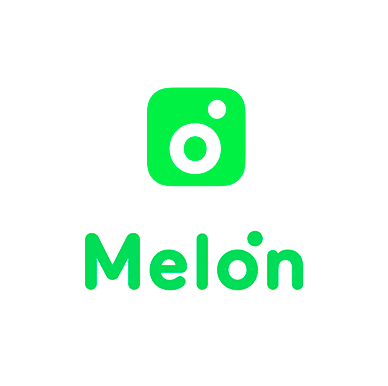

# 🍈 멜론 차트 API: melon-chart.py 


melon-chart.py is a Python API that retrieves the TOP 100 information from the [Melon](https://www.melon.com/index.htm)

국내 음원차트 멜론 실시간 TOP 100 차트를 불러오는 API입니다.

## Installation
```commandline
pip install melon-chart.py
```

## Quickstart
The main usage of melon-chart.py is similar to [billboard.py](https://github.com/guoguo12/billboard-charts).
```commandline
>>> from melon import *
>>> chart = ChartData(imageSize=500)
>>> print(chart[0].json())
{
    "artist": "IVE (아이브)",
    "image": "https://cdnimg.melon.co.kr/cm2/album/images/112/11/297/11211297_20230327114349_500.jpg?7d9408105554f2f425c3d1d43ddd3d9f/melon/resize/500/optimize/90",
    "isNew": false,
    "lastPos": 1,
    "rank": 1,
    "title": "Kitsch"
}
>>> print(chart.name)
멜론차트_TOP100NOW
>>> print(chart.date)
2023-04-09 20:00:00
```

### ChartData Arguments
- `imageSize` – The size of cover image for the track. (default: 256)
- `fetch` – A boolean value that indicates whether to retrieve the chart data immediately. If set to `False`, you can fetch the data later using the `fetchEntries()` method.

### Chart entry attributes
`ChartEntry` can be accessed using the `ChartData[index]` syntax. A `ChartEntry` instance has the following attributes:
- `title` – The title of the track
- `artist` – The name of the artist
- `image` – The URL of the cover image for the track
- `lastPos` - The track's last position on the previous period.
- `rank` – The track's current rank position on the chart.
- `isNew` – Whether the track is new to the chart.

### K-Pop music chart Python APIs
- [Melon | melon-chart.py](https://github.com/gold24park/melon-chart.py)
- [Bugs | bugs-chart.py](https://github.com/gold24park/bugs-chart.py)
- [Genie | genie-chart.py](https://github.com/gold24park/genie-chart.py)
- [Vibe | vibe-chart.py](https://github.com/gold24park/vibe-chart.py)
- [Flo | flo-chart.py](https://github.com/gold24park/flo-chart.py)

## Dependencies
- [requests](https://requests.readthedocs.io/en/latest/)

## License
This project is licensed under the MIT License.
